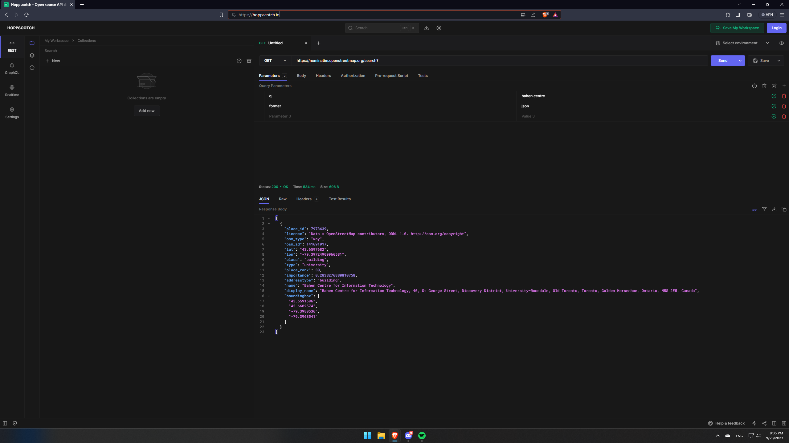
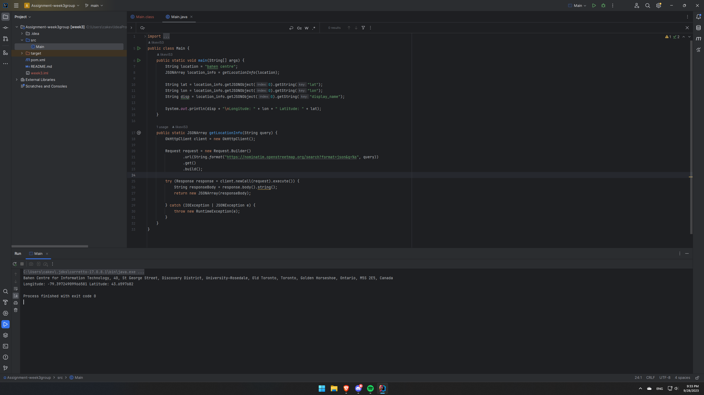

# Week 3 Group Assignment

Kevin Li, Stefan Vuia, Zixuan Lu... 

## Problem Domain and Project Overview

The problem domain for our project is  [?]. We are considering a [?] application with some of the following features:

- Profile creation and accessing saved [?] on profile
- Searching up [? locations] and displaying the results
- Fetching location data and placing markers on a map
- Saving and retrieving locations [?]
- Routing between saved locations [?]

## API 

We are planning to use the Nominatim API for geocoding and location information, such as longitude,
latitude, full address, and location type. This API uses OpenStreetMap data, the API documentation can 
be found at [here](https://nominatim.org/release-docs/develop/api/Overview/#nominatim-api "Nominatim Manual"). Example outputs 
from Java and Hoppscotch.io can be found below, see `src/Main.java` for the full java code.

